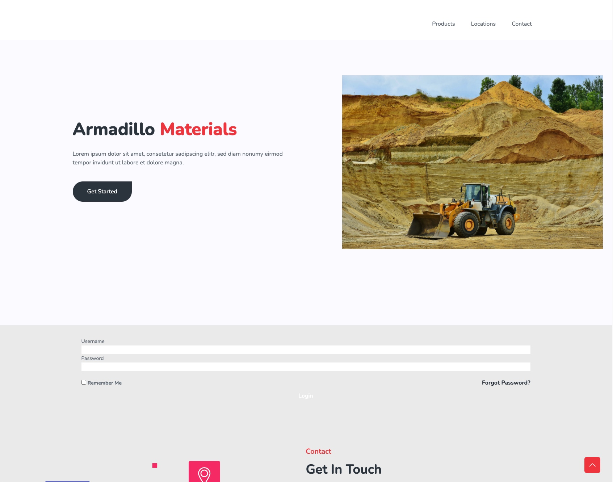

# Module 15-16 - Group Project 2 - Armadillo Materials

<h1 align="center">
    <a href="https://glacial-reef-85694.herokuapp.com/" target="_blank">
     View Demo
    </a>
</h1>
<div align="center">
    
</div>

## Table of Contents

- [About](#about)
- [Getting Started](#getting_started)
- [Contributing](./CONTRIBUTING.md)
- [License](./LICENSE)
- [Code of Conduct](./CODE_OF_CONDUCT.md)

## About <a name = "about"></a>

### Project Requirements

```
- You and your group will use everything you’ve learned over the past six weeks to create a real-world full-stack application that you’ll be able to showcase to potential employers. The user story and acceptance criteria will depend on the project that you create, but your project must fulfil the following requirements:

- Use Node.js and Express.js to create a RESTful API.

- Use Handlebars.js as the templating engine.

- Use MySQL and the Sequelize ORM for the database.

- Have both GET and POST routes for retrieving and adding new data.

- Be deployed using Heroku (with data).

- Use at least one new library, package, or technology that we haven’t discussed.

- Have a polished UI.

- Be responsive.

- Be interactive (i.e., accept and respond to user input).

- Have a folder structure that meets the MVC paradigm.

- Include authentication (express-session and cookies).

- Protect API keys and sensitive information with environment variables.

- Have a clean repository that meets quality coding standards (file structure, naming conventions, follows best practices for class/id naming conventions, indentation, quality comments, etc.).

- Have a quality README (with unique name, description, technologies used, screenshot, and link to deployed application).

- Finally, you must add your project to the portfolio that you created in Module 2.
```

## Getting Started <a name = "getting_started"></a>

These instructions will get you a copy of the project up and running on your local machine for development and testing purposes.

### Prerequisites

- [Autoprefixer](https://www.npmjs.com/package/autoprefixer)
- [Bcrypt](https://www.npmjs.com/package/bcrypt)
- [Connect-session-sequelize](https://www.npmjs.com/package/connect-session-sequelize)
- [Dotenv](https://www.npmjs.com/package/dotenv)
- [Express](https://www.npmjs.com/package/express)
- [Express-handlebars](https://www.npmjs.com/package/express-handlebars)
- [Express-session](https://www.npmjs.com/package/express-session)
- [MySQL](https://www.npmjs.com/package/mysql)
- [Node.js](https://nodejs.org/en/)
- [PostCSS](https://www.npmjs.com/package/postcss)
- [Sequelize](https://www.npmjs.com/package/sequelize)
- [Tailwindcss](https://www.npmjs.com/package/tailwindcss)
- [UUID](https://www.npmjs.com/package/uuid)

### Installing

1. Clone this repo.
2. Navigate to repo folder.
3. Run `npm install` to install the packages listed above.
4. Run `node server.js`
5. Open a new tab in your browser and navigate to http://localhost:3000

## Contact <a name = "contact"></a>

- [Clayton](https://github.com/fremen432)

- [David](https://github.com/somdobomk)

- [Mickey](https://github.com/MickeyPhillips)

- [William](https://github.com/nguyen-william93)
